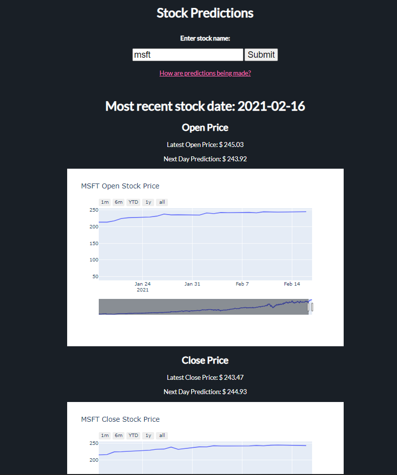

 # Stock Prediction Flask App
 A web app that predicts the next day open, close, high, and low prices of a stock using 
 a simple linear regression model.
 It can be visited here: https://stock-prediction-flask-app.herokuapp.com/  
 (Note: It may take a few seconds to wake up the Heroku server)

  ## Preview
   

  ## Technologies
  * [Python 3.8](https://www.python.org/)
  * [Flask 1.1.2](https://flask.palletsprojects.com/en/1.1.x/)
  * [pandas_datareader 0.9.0](https://pandas-datareader.readthedocs.io/en/latest/)   
  * [plotly 4.14.1](https://plotly.com/)  
  * [scikit-learn 0.24.0](https://scikit-learn.org/stable/)
  * Heroku
  * HTML
  * CSS
  * JavaScript
   
